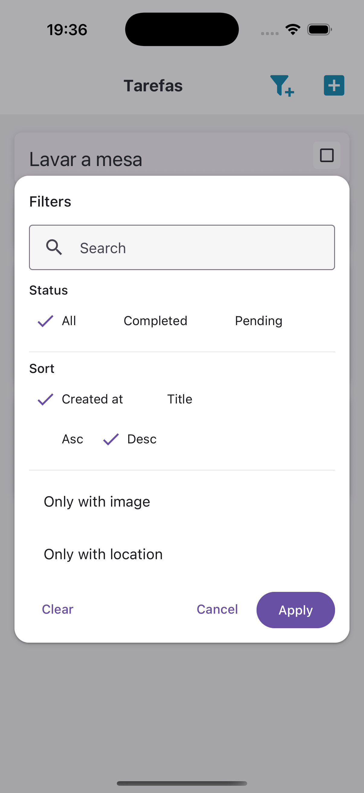
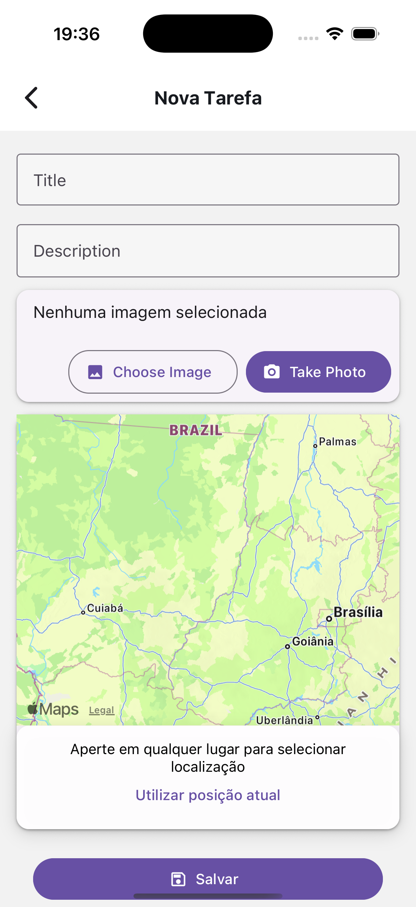
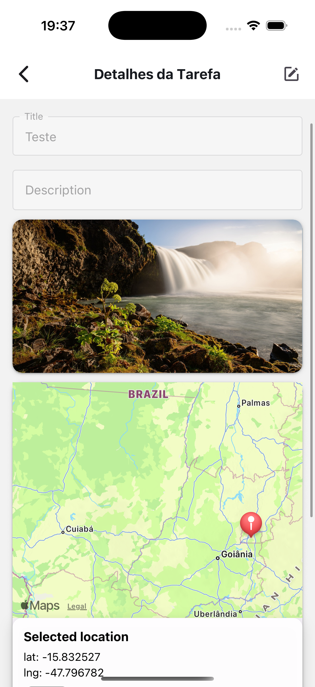

# TodoApp

Aplicativo de **lista de tarefas**.
O projeto foi construído utilizando **Expo**, **React Native** e **TypeScript**, com persistência local e recursos nativos como **câmera**, **galeria** e **localização**.

---

## Demonstração






**[Video de demonstração](src/assets/demo.mov)**

---

## Funcionalidades

### Básicas

- Criar nova tarefa
- Listar todas as tarefas
- Editar tarefa
- Excluir tarefa
- Marcar como concluída ou pendente
- Filtrar e ordenar tarefas

### 📱 Funcionalidades Nativas

- Anexar foto (câmera ou galeria)
- Selecionar localização da tarefa ou usar localização atual do dispositivo
- Compressão de imagem diminuindo a qualidade para economizar armazenamento

### 💾 Persistência

- Todos os dados são salvos localmente
- Dados salvos localmente usando **SQLite**
- As informações permanecem mesmo após fechar o app

---

## Estrutura de Dados do Sistema

```ts
{
  id: string
  title: string
  description?: string
  completed: boolean
  imageUri?: string
  latitude?: number
  longitude?: number
  createdAt: number (timestamp)
  updatedAt: number (timestamp)
}
```

---

## Telas

| Tela                    | Descrição                                                      |
| ----------------------- | -------------------------------------------------------------- |
| **Lista de Tarefas**    | Exibe todas as tarefas com opção de filtro e botão de criação. |
| **Criar/Editar Tarefa** | Formulário com título, descrição, foto e localização.          |
| **Detalhe da Tarefa**   | Mostra informações completas, incluindo imagem e coordenadas.  |

---

## Tecnologias Utilizadas

### Core

- **Expo** — para integração nativa simplificada e diminuição das configurações necessarias
- **React Native**
- **TypeScript**

### Estado e Navegação

- **React Navigation** — navegação entre telas mais utilizado
- **Context API** — gerenciamento de estado global que mais utilizo

### Persistência

- **SQLite (expo-sqlite)** - adaptação mais facilitada pela experiência com query pura
- **expo-file-system** - salvamento das imagens mais simplificado, porém foi necessario utilizar o legacy para implementar as funcionalidades

### Recursos Nativos

Foi utilizado os recursos padrões disponiveis na documentação da Expo, além de intuitivos são bem simplificados.

- **expo-image-picker** — câmera e galeria
- **expo-location** — geolocalização
- **expo-permissions** — controle de permissões

---

## Como Rodar o Projeto

### Pré-requisitos

- Node.js LTS
- Yarn ou NPM
- Expo CLI (`npm install -g expo-cli`)

### Instalação

```bash
# Clonar o repositório
git clone https://github.com/PauloHenriqueMagno/TodoApp.git

# Acessar o diretório
cd TodoApp

# Instalar dependências
yarn install

# Rodar o projeto
yarn start
```

### Executar no emulador ou dispositivo

- **iOS:** pressione `i` no terminal
- **Android:** pressione `a`
- **Web:** pressione `w`

---

## Estrutura de Pastas

```
src/
 ├── config/                    # Configurações gerais do app
 │   └── di/                    # Composição de dependências (Dependency Injection)
 │
 ├── infra/                     # Infraestrutura — camada mais próxima do sistema
 │   └── db/                    # Configuração do banco de dados (SQLite)
 │
 ├── data/                      # Implementações concretas de repositórios e fontes de dados
 │   ├── datasources/           # Fontes de dados (banco local, APIs, etc.)
 │   │   └── sqlite/            # Implementação do datasource usando SQLite
 │   ├── mappers/               # Conversores entre modelos (Entity ↔ DB Row)
 │
 ├── domain/                    # Regras de negócio (camada pura)
 │   ├── entities/              # Entidades centrais da aplicação (ex: Todo)
 │   ├── repositories/          # Interfaces dos repositórios (contratos de persistência)
 │   └── usecases/              # Casos de uso (ex: criar, atualizar, deletar tarefa)
 │
 ├── presentation/              # Camada de interface (UI e lógica de apresentação)
 │   ├── components/            # Componentes reutilizáveis de interface (botões, cards, etc.)
 │   ├── context/               # Contextos globais (ex: permissões, tema, estado global)
 │   ├── navigation/            # Configuração de navegação (React Navigation)
 │   └── screens/               # Telas do app (Lista, Criar/Editar, Detalhe)
 │
 ├── theme/                     # Estilos globais, paleta de cores e tipografia
 │
 ├── types/                     # Tipos globais e declarações TypeScript
 │
 ├── utils/                     # Funções auxiliares e utilitários genéricos (formatação, validações, etc.)
 │
 └── App.tsx.                   # Ponto de entrada da aplicação
```

---

## Desafios e Soluções

| Desafio                | Solução                                                                                      |
| ---------------------- | -------------------------------------------------------------------------------------------- |
| Controle de permissões | Contexto global para pedir e gerenciar permissões dinamicamente.                             |
| Persistência offline   | Uso de SQLite com mapeamento de entidade e sincronia local.                                  |
| Captura de imagem      | Uso de `expo-image-picker`.                                                                  |
| Geolocalização         | Implementado com `expo-location`, exibindo coordenadas.                                      |
| UX e UI                | IA Visily para gerar o layout e exemplo do fluxo do app.                                     |
| Salvamento de arquivos | Implementado com o legacy, testei outras alternativas mas não encontrei algo do mesmo nivel. |

---

## Melhorias Futuras

- Notificações locais (lembretes)
- Dark mode
- Animações e feedback mais claros
- Testes unitários com Jest
- Estrutura de cores mais padronizadas

---

## 🕒 Tempo Investido

> 9 horas
